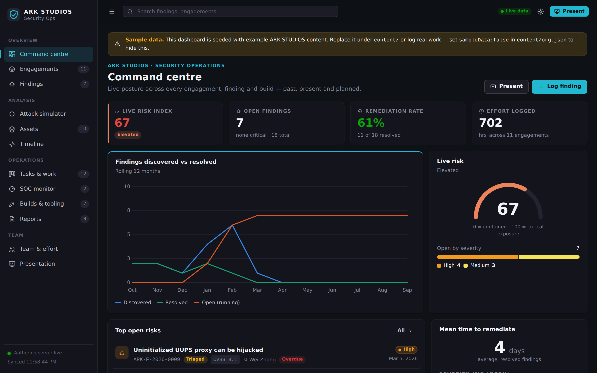

# ARK STUDIOS — Security Operations Dashboard

A dashboard for the ARK STUDIOS security team to **log, track and present** all of its
security work — findings, engagements, tasks, assets, SOC events, reports and the
tools it builds — across the past, present and future.

Its headline feature is an **automatic attack simulator**: the moment a finding is
logged, the dashboard classifies it and generates an animated, plain‑English
walkthrough of *how an attacker would exploit it* and *what damage it could cause* —
so non‑technical stakeholders instantly understand the risk. It also has a
**presentation mode** that turns the live data into a board‑ready slide deck.



## What it does

- **Command centre** — live risk index, open findings, remediation rate, effort logged, trends.
- **Engagements** — every assessment/audit/test/hunt, filterable by discipline and by *past / present / planned*. Covers vulnerability assessment, smart‑contract audit, penetration test, load test, bug hunt, network traffic analysis, secure code review, red team, threat model and more.
- **Findings register** — full vulnerability tracker with severity, CVSS, CWE, evidence (code, screenshots, requests, PoCs, on‑chain tx), remediation and lifecycle.
- **Attack simulator** — the differentiator. For any finding (or an ad‑hoc scenario) it renders an animated kill‑chain, a step‑by‑step narration in plain language, a damage model (confidentiality / integrity / availability / financial / reputation / compliance / safety) and a blast‑radius verdict. Deterministic and fully local — no data leaves the browser.
- **SOC monitor** — a feed for the always‑on **ARK Sentinel** bot. Future issues land here automatically via a token‑authed ingest API and can be promoted to findings.
- **Assets, Timeline, Tasks (kanban), Builds & tooling, Reports, Team & effort** — the rest of the program at a glance.
- **Presentation mode** — an auto‑generated deck (plus any saved decks) with keyboard‑driven fullscreen slides, presenter notes and embedded attack simulations. Press **Present** anywhere.
- **Light / dark themes**, responsive down to phone width, printable reports.

## How the team uses it

Everything the dashboard shows lives in the **`content/`** folder as JSON + markdown +
screenshots. The team logs work by **pushing content** — every record is versioned and
reviewable in Git, and the built site is a static artifact that works offline for
presentations. There are three ways to add content:

1. **Push files** — add/edit JSON under `content/` (schema in `src/types.ts`), commit, push.
2. **From the UI** — run the optional authoring server (`npm run server`) and use the **Log finding** button; it writes straight to `content/findings/`.
3. **From the SOC bot** — `POST` events to `/api/ingest` (see below).

Set `"sampleData": false` in `content/org.json` once your real content is in, to hide
the sample‑data banner.

## Quick start

```bash
npm install

# Static dashboard (bundles everything under content/ at build time)
npm run dev            # http://localhost:5173

# ...or with the authoring + ingest server (enables in‑UI editing & SOC ingest)
npm run server         # http://localhost:8787  (in another terminal)
# then open the dev server; it auto‑detects the API and switches to live mode

# Production build (static) — deploy dist/ anywhere
npm run build && npm run preview
```

To serve the built app *and* the API from one process: `npm run build && npm run server`.

## Attack simulator — how it works

1. **Classify** (`src/sim/classify.ts`) — maps the finding to an attack class from its
   CWE/SWC, tags, and free‑text (title/summary), with an engagement‑type fallback.
2. **Template** (`src/sim/templates.ts`) — each class has a scripted kill‑chain: nodes,
   edges, per‑stage narration, technique, defence and MITRE tactic, plus an everyday
   analogy and blast‑radius.
3. **Damage** (`src/sim/damage.ts`) — a per‑class impact profile scaled by severity.
4. **Render** (`src/components/AttackSimulation.tsx`) — animated SVG flow + narration +
   damage meters, with playback controls. It also embeds live in the *Log finding* form.

Override the automatic classification per finding with `attack.class`, and add
`attack.dataAtRisk` / `attack.financialExposure` for richer damage output.

## The SOC bot (ARK Sentinel)

The always‑on bot posts events to the ingest endpoint:

```bash
curl -X POST http://localhost:8787/api/ingest \
  -H 'X-Ingest-Token: <INGEST_TOKEN>' -H 'content-type: application/json' \
  -d '{"severity":"critical","category":"on-chain","title":"Anomalous withdrawal",
       "message":"Single-tx withdrawal 30x daily average","promote":true,
       "attack":{"class":"reentrancy"}}'
```

`promote: true` on a critical/high event also creates a finding automatically. A
reference implementation is in `tools/soc-agent-example.js` (`npm run soc:demo`, or
`node tools/soc-agent-example.js --watch`). Set `INGEST_TOKEN` in the environment for a
real deployment.

## Content model

```
content/
  org.json                 # org, team, SOC bot config, presentation footer
  engagements/*.json       # engagements (one file or an array)
  findings/*.json          # findings — drive the attack simulator
  tasks/*.json             # tasks (kanban)
  assets/*.json            # assets / attack surface
  soc-events/*.json        # SOC bot events
  reports/*.json + *.md    # report index + markdown bodies
  builds/*.json            # tooling the team has built
  decks/*.json             # saved presentation decks (the auto deck is always available)
  evidence/**              # screenshots & files referenced by findings/reports
```

Full TypeScript types: `src/types.ts`. Any JSON file may hold a single record or an array.

## Tooling

```bash
npm run validate          # schema + referential-integrity check on all content
npm run new -- finding "Title" --severity high   # scaffold a new record
npm run typecheck         # tsc --noEmit
npm run soc:demo          # send sample SOC events (needs the server running)
```

## Tech

Vite + React + TypeScript, zero UI framework — hand‑rolled components and SVG charts
(built to the internal data‑viz palette, validated for colour‑blind safety and both
themes). Markdown is sanitised with DOMPurify. The optional server is Express. No
telemetry; the attack simulator runs entirely client‑side.
